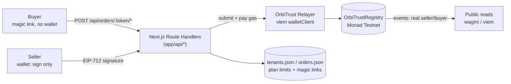
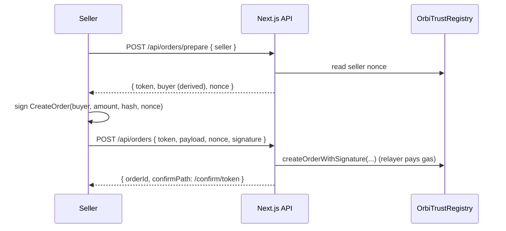

# OrbiTrust

**Verified sales history for social commerce sellers — with gas sponsored by OrbiTrust.**

OrbiTrust turns informal Instagram and WhatsApp sales into portable, verifiable reputation on Monad. In **v2**, buyers and sellers never need to hold MON or sign transactions in MetaMask: the seller signs lightweight EIP-712 messages and **OrbiTrust pays all the gas** through a relayer.

> Google Reviews proves someone wrote an opinion. OrbiTrust proves a commercial operation happened.

> **Trustless data on-chain, sponsored UX off-chain.**

Built at **Monad Blitz Buenos Aires**. This is a testnet demo — no real payments are processed.

---

## 1. Problem

Social commerce in LATAM runs on Instagram, WhatsApp and DMs, but trust is still based on screenshots, follower counts and unverifiable testimonials. Honest sellers need a way to prove commercial history outside closed marketplaces.

And forcing the **buyer** to install MetaMask and hold MON just to confirm a purchase kills the UX of social commerce. Crypto friction is the enemy of conversion.

## 2. Solution

OrbiTrust creates a portable trust profile for sellers. Every TrustOrder follows a simple lifecycle: seller creates, buyer accepts, seller fulfills, buyer confirms, buyer reviews. Reputation is built from completed, verifiable sales.

This is **not** a generic reviews app. A review only counts when it is linked to a completed TrustOrder between a buyer and a seller. The core primitive is the *completed commercial operation*, not the review.

**v2 model — sponsored gas / multitenant SaaS:**

- **Tenant = seller.** A seller registers on-chain (handle + metadata) and gets an off-chain tenant record (plan + monthly limits).
- The **OrbiTrust relayer** submits every transaction and pays gas from a pool (`RELAYER_PRIVATE_KEY`).
- **Sellers** keep a wallet, but only to **sign** EIP-712 messages — they never pay gas.
- **Buyers** confirm actions through a **magic link** (`/confirm/[token]`) with **no wallet and no MON**.
- On-chain events stay attributed to the **real seller/buyer**, never to the relayer.

The seller pays an OrbiTrust plan; OrbiTrust sponsors the gas. Because Monad makes many small events cheap, sponsoring every order/accept/confirm/review is economically viable.

## 3. Why Monad

OrbiTrust records many small trust events. Monad's EVM compatibility and high-throughput, low-cost design make it a natural fit for fast reputation primitives — **and** for a sponsorship model where the platform absorbs the gas of thousands of tiny confirmations.

Each trust event — order created, accepted, fulfilled, completed, reviewed — is recorded on Monad Testnet, making reputation portable across channels and platforms.

## 4. Architecture v2 (Sponsored Gas)



**How attribution survives the relayer.** Each write action has an EIP-712 typed-data variant (`*WithSignature`). The actor (seller or buyer) signs the action + a per-address nonce; the contract runs `ECDSA.recover` over the EIP-712 digest and acts **as the recovered signer**, not as `msg.sender`. So the explorer shows `from = relayer`, but `SellerRegistered`, `OrderCreated`, `ReviewLeft`, etc. all index the real wallet.

**How buyers act without a wallet.** When a seller creates an order, the server mints a random magic-link token and derives a deterministic **ephemeral buyer key** from it (`HMAC-SHA256(token, ORDER_TOKEN_SECRET)`). The seller signs `CreateOrder` over that derived buyer address. Later, whoever holds the link triggers `accept` / `confirm` / `review`; the server re-derives the same key, signs the EIP-712 message **server-side**, and relays it. The buyer gets a real, unique on-chain identity without ever touching a wallet.

> **Security tradeoff (documented).** Buyer authority = possession of the magic link (a bearer capability), not a buyer-held private key. This is the pragmatic MVP choice so the buyer needs nothing but a URL. Tokens are random 32-byte values, expire (`ORDER_TOKEN_TTL_DAYS`, default 7), and are single-use **per action**. v2.1 path: passkey/email smart-wallet so the buyer signs from their own device. The contract is already EIP-712-native, so moving the buyer signature client-side requires **no contract change**.

### Sponsored order creation is two steps



The seller can't know the buyer address up front (the buyer has no wallet), so `prepare` returns the server-derived buyer address for the seller to sign over.

## 5. Contract lifecycle

```
Seller registers  ──▶  Create TrustOrder  ──▶  Buyer accepts
                                                     │
                                                     ▼
Buyer reviews  ◀──  Buyer confirms received  ◀──  Seller fulfills
```

- A wallet registers **one** seller profile (a handle + metadata URI).
- The seller creates a `TrustOrder` for a buyer (a reference amount + a short description).
- The buyer **accepts**, the seller **marks fulfilled**, the buyer **confirms received**.
- Confirming reception increments the seller's `completedSales`.
- Only **after** completion can the buyer leave a **verified review** (rating 1–5).
- The public profile shows completed sales, review count, average rating and a trust score.

**Trust score V1:** `completedSales * 10 + averageRating * 10`, capped at 100. Intentionally simple for the demo.

## 6. Smart contract

`contracts/OrbiTrustRegistry.sol` (Solidity `0.8.28`, `evmVersion: "prague"`). Uses OpenZeppelin `EIP712` + `ECDSA`.

**Data model**

- `enum OrderStatus { Created, Accepted, Fulfilled, Completed, Cancelled }`
- `struct Seller { owner, handle, metadataURI, completedSales, reviewsCount, ratingSum, exists }`
- `struct TrustOrder { id, seller, buyer, amount, metadataHash, status, reviewed, createdAt }`

**Storage:** `sellers`, `orders`, `sellerOrders` (private), `nextOrderId`, and `nonces` (`mapping(address => uint256)` for EIP-712 replay protection).

**Direct functions (`msg.sender`):** `registerSeller`, `createOrder`, `acceptOrder`, `markFulfilled`, `confirmReceived`, `cancelOrder`, `leaveReview`.

**Sponsored functions (EIP-712 + nonce, relayer-submittable):** `registerSellerWithSignature`, `createOrderWithSignature`, `acceptOrderWithSignature`, `markFulfilledWithSignature`, `confirmReceivedWithSignature`, `cancelOrderWithSignature`, `leaveReviewWithSignature`.

**Views:** `getSeller`, `getOrder`, `getSellerOrderIds`, `getAverageRating`, `getTrustScore`, `nonces`, `domainSeparator`.

**Events:** `SellerRegistered`, `OrderCreated`, `OrderAccepted`, `OrderFulfilled`, `OrderCompleted`, `OrderCancelled`, `ReviewLeft` (unchanged — sponsored paths emit the same events for the real actor).

**Custom errors:** the v1 set plus `InvalidNonce`.

The original direct functions are kept for compatibility and tests; the sponsored variants wrap the same internal core logic, so behaviour and events are identical regardless of path.

Run the suite (**27 tests**: the original 20 lifecycle/guard/score tests + 7 EIP-712 sponsored-path tests):

```bash
npm test
```

## 7. Local setup

Requirements: Node 18+ and npm.

```bash
# 1. install
npm install

# 2. compile the contract + export the ABI to the frontend
npm run compile

# 3. run the tests (optional but recommended)
npm test

# 4. configure env (see §9) and start the app
cp .env.example .env   # then fill in the values
npm run dev            # open http://localhost:3000
```

The app still works without a relayer: the dashboard shows a banner explaining sponsored gas is off, and you can browse the UI and the `/demo` profile. To exercise the sponsored on-chain flow, set the relayer env vars (§9) and deploy.

## 8. Deploy & verify on Monad Testnet

1. Fund a **testnet** wallet from the [Monad faucet](https://faucet.monad.xyz) and set `PRIVATE_KEY` in `.env`. Never commit a real key.

2. Deploy:

   ```bash
   npm run deploy
   ```

   The script prints the contract address, writes `lib/contract/deployment.json`, and refreshes the frontend ABI (`lib/contract/abi.ts`). Set `NEXT_PUBLIC_ORBITRUST_CONTRACT_ADDRESS` in `.env` (the frontend falls back to `deployment.json`).

3. Verify (devnads multi-explorer API — see the project skill for details):

   ```bash
   BUILD_INFO=$(ls -t artifacts/build-info/*.json | head -1)
   LONG=$(jq -r '.solcLongVersion' "$BUILD_INFO")   # e.g. 0.8.28+commit.7893614a
   jq -n --arg addr "<CONTRACT_ADDRESS>" \
         --arg name "contracts/OrbiTrustRegistry.sol:OrbiTrustRegistry" \
         --arg ver "v$LONG" \
         --argjson input "$(jq '.input' "$BUILD_INFO")" \
     '{chainId:10143, contractAddress:$addr, contractName:$name, compilerVersion:$ver, standardJsonInput:$input}' \
   | curl -sS -X POST https://agents.devnads.com/v1/verify -H "Content-Type: application/json" -d @-
   ```

   Use `solcLongVersion` (with the commit hash) — the short `0.8.28` is rejected by Monadscan.

4. Restart `npm run dev`.

**Network:** Monad Testnet · chain id `10143` · RPC `https://testnet-rpc.monad.xyz` · explorer `https://testnet.monadexplorer.com`.

**Deployments**

| Version | Address | Notes |
| --- | --- | --- |
| v2 (current) | `0x873A4206BAd21915A9d0A083e2717D0b5A42b7B6` | EIP-712 sponsored meta-tx · [verified on Monadscan](https://testnet.monadscan.com/address/0x873A4206BAd21915A9d0A083e2717D0b5A42b7B6) |
| v1 | `0xafdb2daa48CceA0d59bF8A1689A54909e901745C` | Original direct-`msg.sender` lifecycle (each wallet paid its own gas) |

## 9. Environment variables

| Variable | Used by | Description |
| --- | --- | --- |
| `PRIVATE_KEY` | deploy | Testnet deployer key. **Never commit.** |
| `MONAD_RPC_URL` | deploy / relayer | RPC URL. Defaults to the public Monad RPC. |
| `RELAYER_PRIVATE_KEY` | server (relayer) | Funded testnet key that **submits every tx and pays gas**. In dev it can equal `PRIVATE_KEY`; in prod use a dedicated, monitored pool. **Never commit.** |
| `ORDER_TOKEN_SECRET` | server | HMAC secret for magic-link tokens + ephemeral buyer-key derivation. Generate with `node -e "console.log(require('crypto').randomBytes(32).toString('hex'))"`. **Never commit.** |
| `TENANT_STORE_PATH` | server | JSON tenant store path. Default `./data/tenants.json`. |
| `ORDER_STORE_PATH` | server | JSON order/magic-link store path. Default `./data/orders.json`. |
| `SPONSORED_TX_DAILY_LIMIT` | server | Global daily cap on sponsored txs (rate limit). Default `100`. |
| `ORDER_TOKEN_TTL_DAYS` | server | Magic-link expiry in days. Default `7`. |
| `NEXT_PUBLIC_ORBITRUST_CONTRACT_ADDRESS` | frontend | Deployed contract address (falls back to `deployment.json`). |
| `NEXT_PUBLIC_CHAIN_ID` | frontend | `10143`. |
| `NEXT_PUBLIC_MONAD_RPC_URL` | frontend | Optional RPC override for browser reads. |

Secrets live only on the server (`lib/server/env.ts`, imported with `server-only`). Private keys are never logged and never sent to the client. `data/` is gitignored (only `.gitkeep` is tracked).

## 10. Sponsored flow & E2E

**Manual E2E**

1. Seller connects wallet → **register** (signs in wallet, OrbiTrust pays gas — no MON spent).
2. Seller **creates an order** → copies the buyer **magic link** (WhatsApp-friendly).
3. Buyer opens the link in incognito → **accept + confirm + review**, no wallet, no MON.
4. Seller profile shows updated stats (completed sales, reviews, rating, trust score).
5. The explorer shows `from = relayer`, but events index the real buyer/seller.

**Automated smoke test.** With the app running (`npm run dev`) and the relayer configured:

```bash
npm run smoke
```

It spins up a throwaway, **unfunded** seller key, signs EIP-712 messages with viem, and drives the full lifecycle through the HTTP API (register → create → accept → fulfill → confirm → review), then asserts on-chain state. It proves the seller pays no gas and the buyer needs no wallet.

API surface (`app/api/`): `POST /api/relay` (seller-signed register/fulfill/cancel), `POST /api/orders/prepare` + `POST /api/orders` (two-step create), `GET /api/orders/[token]` + `POST /api/orders/[token]/{accept,confirm,review}` (buyer magic-link actions), `GET /api/tenant/[address]` (plan + usage), `GET /api/health` (relayer status).

## 11. Multitenancy (MVP)

- Plans (`lib/tenant/plans.ts`, single source of truth): **Básico / Pro / Ultra** with hardcoded `monthlyOrderLimit`.
- Tenants are auto-provisioned on first `registerSeller` and stored in `data/tenants.json`.
- Order creation is **gated** by the plan's monthly limit; the dashboard shows a "Tu plan" card with `N/limit órdenes este mes` and an upgrade prompt.
- No real billing — only gating + UI prompts.

## 12. Pitch

> Google Reviews proves that someone wrote an opinion. OrbiTrust proves that a commercial operation happened between a buyer and a seller. For social commerce — Instagram, WhatsApp, DMs — that difference matters. And the buyer shouldn't need crypto to participate: the seller pays an OrbiTrust plan, OrbiTrust sponsors the gas, and the buyer just taps a link. Reputation should be based on completed, verifiable sales — not screenshots.

---

## Tech stack

- **Contract:** Solidity `0.8.28` + Hardhat (`@nomicfoundation/hardhat-toolbox`) + OpenZeppelin (`EIP712`, `ECDSA`)
- **Frontend:** Next.js 14 (App Router) + TypeScript + Tailwind CSS
- **Backend:** Next.js Route Handlers (Node runtime) + viem relayer
- **Wallet / chain:** wagmi + viem (`monadTestnet`), injected connector — used for **signing only**

## Project structure

```
contracts/OrbiTrustRegistry.sol   # trust registry + EIP-712 sponsored meta-tx
scripts/deploy.js                 # deploy + write address/ABI to the frontend
scripts/export-abi.js             # ABI -> lib/contract/abi.ts
scripts/smoke-sponsored.mjs       # end-to-end sponsored-flow smoke test
test/OrbiTrustRegistry.test.js    # 27 tests (lifecycle + EIP-712)
lib/contract/                     # address/ABI/explorer + shared EIP-712 types + public client
lib/relayer/client.ts             # viem wallet+public client, recover + relay (gas pool)
lib/server/                       # env (server-only), JSON store, rate limit, http helpers
lib/tenant/                       # plans (client-safe) + tenant store (server)
lib/orders/                       # magic-link tokens, ephemeral buyer keys, buyer actions
lib/sponsored/client.ts           # browser helper: build typed data, call sponsored API
lib/hooks.ts                      # wagmi reads + useSponsoredTx / useTenant / useSponsorHealth
components/                       # UI (cards, badges, forms, stepper, SponsorBadge, PlanCard)
app/api/                          # relay, orders(+prepare,+token actions), tenant, health
app/                              # /, /dashboard, /order/[id], /seller/[address], /confirm/[token], /demo
```

## MVP vs v2.1

**Shipped in this MVP (v2.0)**

- EIP-712 meta-transactions for every action; relayer pays all gas.
- Sellers sign in-wallet (no MON); buyers act via magic link (no wallet, no MON).
- Server-derived ephemeral buyer keys (HMAC) so buyers get a real on-chain identity.
- Multitenant plans + monthly order gating + dashboard "Tu plan" card.
- File-based tenant/order stores, IP + global daily rate limits, single-use expiring links.
- Contract redeployed (v2) and verified; full Spanish buyer/seller UI; automated smoke test.

**Deferred to v2.1+**

- **Passkey / email smart-wallet** so the buyer signs from their own device (replaces the magic-link bearer model — no contract change needed).
- Per-tenant (not just global) rate limiting and abuse monitoring on the relayer pool.
- Durable storage (SQLite/Postgres) instead of JSON files; multi-instance safe nonce management.
- Real billing + plan upgrades; buyer reputation weighting and anti-sybil scoring.
- Payment-link integrations, shipping/completion proofs, embeddable trust badges, dispute resolution.

## Deploy en Vercel

El frontend y las API routes se publican en Vercel; el contrato sigue desplegándose en local con `npm run deploy`. Guía paso a paso (variables, MongoDB Atlas, relayer, limitaciones de stores en serverless): **[docs/DEPLOY_VERCEL.md](docs/DEPLOY_VERCEL.md)**.

## Cursor skill (Monad development)

This repo includes a project skill for Cursor agents at [`.cursor/skills/monad-development/SKILL.md`](.cursor/skills/monad-development/SKILL.md). It covers Monad Testnet defaults, OrbiTrust deploy/verify workflows, faucet funding, and wagmi/viem conventions. Reference material for greenfield Foundry work lives in [`.cursor/skills/monad-development/reference.md`](.cursor/skills/monad-development/reference.md).
